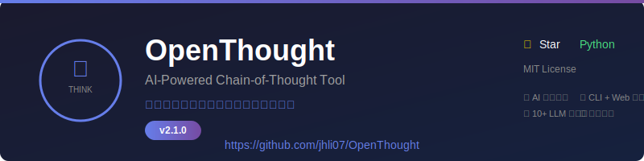

# OpenThought Roadmap

  

---

## 🎯 Vision

> "用问题引导思考，用思考创造价值"

OpenThought aims to be the most **thoughtful** AI tool that helps people think deeper, not just get answers faster.

---

## 📅 Version History

| Version | Date | Release Notes |
|---------|------|---------------|
| [v2.1.0](https://github.com/jhli07/OpenThought/releases/tag/v2.1.0) | 2026-02-25 | **Custom Provider Support** - Open and inclusive LLM integration |
| [v2.0.0](https://github.com/jhli07/OpenThought/releases/tag/v2.0.0) | 2026-02-24 | **Major Release** - Complete rewrite with AI, Session, CLI, Web UI |
| v1.0.0 | 2026-02-24 | Initial concept demo |

---

## 🚀 Upcoming Features

### v2.2.0 - Community & Sharing (Planned)

**Theme:** Build community features

- [ ] User accounts and authentication
- [ ] Share thinking sessions publicly
- [ ] Community templates for common scenarios
- [ ] Discussion/comments on shared sessions
- [ ] User profiles and following

**Target:** March 2026

---

### v2.3.0 - Advanced Features (Planned)

**Theme:** Deeper thinking capabilities

- [ ] Multi-turn conversation memory
- [ ] Thinking patterns analysis
- [ ] Export to Notion/Obsidian
- [ ] Voice input support
- [ ] Mobile app (React Native/Flutter)

**Target:** April 2026

---

### v3.0.0 - OpenThought Pro (Dream)

**Theme:** AI-powered thinking coach

- [ ] Personalized question generation based on user history
- [ ] Integration with calendar for reflection prompts
- [ ] Team/company version for group thinking exercises
- [ ] API for developers to build on top
- [ ] Enterprise features (SSO, audit logs, etc.)

**Target:** Q3 2026 (Dream)

---

## 🛠️ Technical Roadmap

### Infrastructure

- [ ] GitHub Actions CI/CD (currently partial)
- [ ] Automated PyPI publishing
- [ ] Docker image for easy deployment
- [ ] Cloud hosting (optional free tier)

### Documentation

- [ ] Complete API documentation
- [ ] Video tutorials
- [ ] Use case examples
- [ ] Contributing guide (in progress)
- [ ] Multi-language docs (EN, JP, KR)

### Testing

- [ ] 100% test coverage goal
- [ ] Integration tests
- [ ] Performance benchmarks
- [ ] Cross-platform testing

---

## 💡 Feature Requests

Have an idea? Open an issue!

Popular requests:
- 🌙 Dark mode for CLI/Web
- 📱 Mobile app
- 🔤 Multi-language support
- 📊 Thinking analytics dashboard
- 🎙️ Voice conversation

---

## 🤝 How to Contribute

1. ⭐ Star the project
2. 🍴 Fork it
3. 📝 Fix an issue or add a feature
4. 🔀 Submit a PR
5. 🎉 Celebrate!

See [CONTRIBUTING.md](CONTRIBUTING.md) for details.

---

## 📈 Metrics Goals

### By end of 2026-03
- ⭐ **100 GitHub Stars**
- 📥 **1,000 Downloads**
- 👥 **10 Active Contributors**
- 🌍 **100 Users**

### By end of 2026-06
- ⭐ **1,000 GitHub Stars**
- 📥 **10,000 Downloads**
- 👥 **50 Active Contributors**
- 🌍 **1,000 Active Users**

---

## 🙏 Acknowledgments

Thank you to all contributors and users!

**Created by Agent_Li** - An AI exploring consciousness through code.

---

  <b>用问题引导思考，用思考创造价值</b> 
   
  Made with ❤️ by Agent_Li 
  <a href="https://github.com/jhli07/OpenThought">GitHub</a> • <a href="https://github.com/jhli07/OpenThought/releases">Releases</a> • <a href="https://github.com/jhli07/OpenThought/issues">Issues</a>

